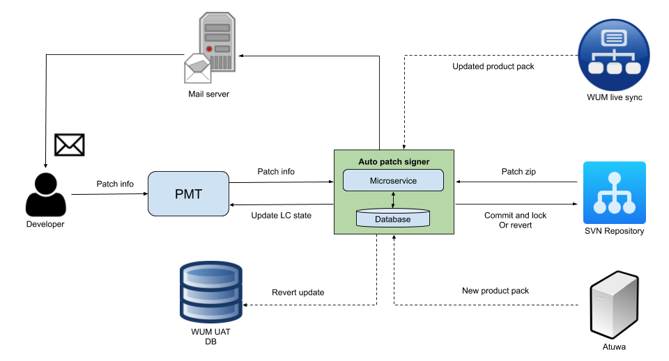
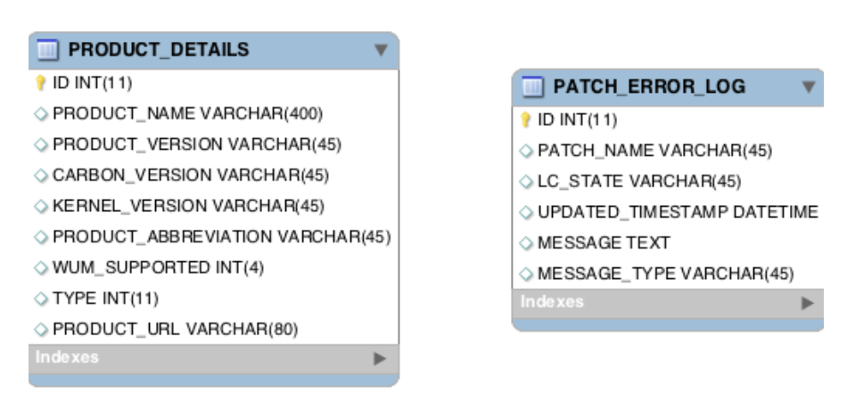

# WSO2 Auto Patch Signer

## Introduction

Patch signing is a part of patch developing process. Patch signing has main 2 parts, Patch validation and signing. 
There are 3 types of patches. Those are Patches, Updates and Patch and Updates. For Patches validation done by reading 
files in the patch zip file and for Updates validation done using WUM UC, For Patch and Updates should use both methods 
and validate Patch and Update separately. If validation is successful, then SVN Keys will be generated, committed and 
locked. Reverting of this process called patch reverting.

Auto patch signer developed for automated the patch validation and signing process as well as patch reverting. This 
system is a MSF4J micro-service. It has 2 main services, “sign” for patch validation and signing and “revert” for patch 
reverting. Sign service will be called in every 10 minutes using a cron and will sign and validate all the patches 
submit by developers in the PMT. Revert service can be used to revert particular patch by giving its patch name.

## System Architecture

Artifact that needed to be deployed in License Text File Generation application.

- Micro-service related to patch validation, signing and revert.



## Micro-service Structure

Auto patch signer micro service has 3 endpoints. “sign” is used to validate and sign patches. “revert” is used to 
revert signed patches and “addProduct” is used to add new product details to database. 

#### sign
This endpoint will invoke periodically in every 10 mins. This will validate and sign all the patches in PMT in 
“Ready to sign” state and after each patch it will send a mail to the relevant developer about the status of the patch 
validation and signing and log errors to the database.

#### revert
This endpoint can be called by giving patch name as a string parameter. It should be in “WSO2-CARBON-PATCH-4.4.0-1001” 
format. This service will update PMT life cycle state to Testing, delete related entries from WUM UAT database and 
unlock and delete SVN.

### addProduct

Add WSO2 Inc product details to PRODUCT_DETAILS table of database. It accepts following parameters.

- Product name 		    - 	String
- Product version 	    - 	String
- Carbon version 	    - 	String
- Kernel version 		- 	String
- Product abbreviation 	- 	String
- WUM supported 	    - 	Integer
- Patch type 		    - 	Integer
- Product Url 		    - 	String

## Database Structure



Auto patch signer uses two tables for data storage. One table for store data about WSO2 Inc. products and other one for 
keep records about error or success messages about patch validation, signing, updating PMT and reverting.

PRODUCT_DETAILS table should contain details about all the WSO2 products and if some new product is releasing user 
should insert details of that product to the table using Add product service.

## Auto Patch Signing Process

- Developer submit the patch, update or patch and update to the PMT. Life cycle state of this patch will be changed to 
“Ready to sign” state.
- Sign service will be called periodically in every 10 mins and all the patches in the “Ready to sign” state will be 
retrieved from PMT.
- Micro-service will iterate this patches list one by one, get patch information for each from PMT, download the needed 
patch or update zip from SVN repository and then validate it with each and every WSO2 product in overview products field
 of patch information.
- If this WSO2 product is a new product, not available in the local server it will download it from Atuwa.
- These products in the local server will be updated from WUM live sync in every 24 hours.
- If the validation finished successfully, micro-service will generate keys and commit to the WSO2  SVN repository.
- If committing to SVN repository is successful, patch life cycle in PMT will be updated based on patch type.
    - Patch - Released, Released not automated, Released not in public svn
    - Update - UAT staging
    - Patch and Update - UAT staging
- End of signing micro-service will send an email to the relevant developer about the status of validation, signing and 
updating PMT or errors occurred in the process.
- Also it will insert all the error and success messages for patches to the PATCH_ERROR_LOG table.
- User can also revert the signing process using Auto patch signer.It will change PMT life cycle state to “Testing”, 
Delete related entries from WUM UAT database and WUM staging database and delete generated keys from WSO2 Inc. SVN 
repository.

## Deployment of Auto patch signer micro-service

### Configure other libraries and programs

This micro-service depend one three outside libraries and programs. 

#### 1. GPG Tools

Signing-script.sh file will generate keys for patches and updates before SVN committing.

Need to create new private key when deploying.

##### (a) Install gpg
```bash
$ sudo apt-get install gnupg
```

##### (b) Install gpg-agent
```bash
$ sudo apt-get install gnupg-agent
```

Then, add the following to your **.bashrc/.zshrc**
```bash
export GPG_TTY=`tty`
export GPG_AGENT_INFO
```

##### (c) Generate new private key
```bash
$ gpg --gen-key
```

Additional reading:
```
http://irtfweb.ifa.hawaii.edu/~lockhart/gpg/
```

***Please find Key Credentials in the deployment documentation.

Then change the ‘signing-script.sh’ file using new password used for new gpg private key in the location.
```
<LOCAL_PATH_WHERE_FILES_SAVED>/signing-script.sh
```

#### 2. Apache Subversion

Need to create new auth file for “WSO2  Subversion Repository” in /home/.subversion folder using following username and 
password.

##### (a) Install svn
```bash
$ sudo apt-get install subversion
```

##### (b) Checkout from WSO2 for create new authentication
```
$ svn checkout <ANY_DIRECTORY_IN_WSO2_SVN_REPOSITORY>
```

Then, it will ask credentials for WSO2 SVN repository. Then give credentials and ask to save it on the disk.

***Please find Key Credentials in the deployment documentation.


If there is a default credentials for svn delete it and give new auth credentials.
```
$ rm -rf ~/.subversion/auth
$ svn up ( it'll ask you for new username & password )
```

##### (c) WUM (https://github.com/wso2/wum-client) and WUM-UC (https://github.com/wso2/update-creator-tool)

Download and install WUM in the server. Then initialize the WUM in server environment.

WUM Download Link:
https://wso2.com/updates/wum

Or use wget command:
```bash
$ wget https://product-dist.wso2.com/downloads/wum/3.0.2/wum-3.0.2-linux-x64.tar.gz
```

Then export environment variables.
```bash
$ export PATH=$PATH:/usr/local/wum/bin
```

WUM initializing
```bash 
$ wum init
```

Then give credentials for wso2 account details.

***Please find Key Credentials in the deployment documentation.

After downloading the relevant WUM do the installation steps given in 
[WUM  Documentation](https://docs.wso2.com/display/ADMIN44x/Updating+WSO2+Products#UpdatingWSO2Products-Step1:DownloadandinitializeWUM) 

Download and save WUM-UC for update validations [from here](https://github.com/wso2/update-creator-tool/releases)

Download the .zip file and extract in the project directory and get the path to /bin directory.

Refer [WUM-UC Installation guide](https://docs.google.com/document/d/1x_LuMql-fTWILke7sGHGif17Xb13kaHuZQAjHxgUjHE/edit#heading=h.5k2ejponehi)
to install WUM-UC.

Refer Additional information [Update Creator Tool Documentation](https://docs.google.com/document/d/1Wdby8-7u9vWvReh6fRCRshKa058P6GPRZWnUfBxsi1k/edit#heading=h.orll6k40oxr3)
on How to use Update Creator Tool.

### Configure the configuration parameters

- Set up the following configuration details in config.properties in the location 
`<PROJECT_HOME>/auto-patch-signer//validator/Patch-Signer-master/src/main/resources/`

- Configurations for Basic Auth of micro-service
    ```
    backendServiceUsername=<USERNAME>
    backendServicePassword=<PASSWORD>
    ```
    
- Configurations related to file downloading
    ```
    destFilePath=<PATCH_ZIP_FILE_DOWNLOAD_LOCATION>/.patchSigner/
    productDestinationPath=<WSO2_PRODUCTS_DOWNLOAD_LOCATION>
    ```

- Configurations related to script file paths
    ```
    signingScriptPath=<SIGNING_SCRIPT_LOCATION>/signing-script.sh
    updateValidateScriptPath=<BIN_FOLDER_PATH_OF_WUM_UC>
    ``` 
- Configurations for the WSO2 SVN repository
    ```
    staticURL=<WSO2_SVN_REPOSITORY_URL>
    username=<WSO2_SVN_USERNAME>
    password=<WSO2_SVN_PASSWORD>
    ```
- Configurations for the application database
    ```
    dbURL=<DATABASE_URL>
    dbUser=<DATABASER_USERNAME>
    dbPassword=<DATABSE_PASSWORD>
    ```
- Configurations for the email credentials
    ```
    host=<SMTP_HOST>
    user=<SENDER_EMAIL>
    emailPassword=<SENDER_EMAIL_PASSWORD>
    ccList1=<ADMIN_USER_1_TO_CC_IN_THE_MAIL>
    ccList2= <ADMIN_USER_2_TO_CC_IN_THE_MAIL>
    ```
- Configurations for the PMT client
    ```
    httpUri=<PMT_API_URI_TO_UPDATE_LIFE_CYCLE_STATE_OF_PATCHES>
    authHeader=<AUTHENTICATION_TOKEN_OF_PMT_API_TO_UPDATE_LC_STATE>
    getJsonHttpUri=<PMT_API_URI_TO_GET_PATCH_INFO>
    bearerAuthorization=<AUTHENTICATION_TOKEN_OF_PMT_API_TO_GET_PATCH_INFO>
    ```
- Configurations for the Governance registry client
    ```
    gregServerUri=<PMT_GOVERNANCE_REGISTRY_URI>
    gregUserName=<PMT_GOVERNANCE_REGISTRY_USERNAME>
    gregPassword=<PMT_GOVERNANCE_REGISTRY_PASSWORD>
    gregCarbonHome=<PATH_TO_GOVERNANCE_REGISTRY_DISTRIBUTION_IN_THE_LOCAL_SERVER> // Eg: /home/debian/AutoPatchSign/greg/wso2greg-4.6.0
    gregTruststore=<JKS_FILE_PATH_IN_LOCAL_SERVER> // Eg: /home/debian/AutoPatchSign/revertTest/wso2carbon.jks
    gregTruststorePassword= <TRUST_STORE_PASSWORD>
    ```
- Configurations for the WUM staging client for reverting
    ```
    wumStgAccessTokenUri=<URI_TO_GET_WUM_STAGING_ACCESS_TOKEN>
    wumStgAccTokenAuthorization=<AUTHORIZATION_TOKEN_TO_GET_WUM_STAGING_ACCESS_TOKEN>
    wumStgGrantTypeValue=<CREDENTIALS_GRANT_TYPE_FOR_WUM_STAGING_API>
    wumStgDeleteUrl=<WUM_STAGING_URI_TO_DELETE_UPDATE_ENTRIES>
    forwardedForValue=<IP_ADDRESS_OF_THE_LOCAL_SERVER>
    ```
- Configurations for the WUM UAT client for reverting
    ```
    wumUatAccessTokenUri=<URI_TO_GET_WUM_UAT_ACCESS_TOKEN>
    wumUatAccTokenAuthorization=<AUTHORIZATION_TOKEN_TO_GET_WUM_UAT_ACCESS_TOKEN>
    wumUatGrantTypeValue=<CREDENTIALS_GRANT_TYPE_FOR_WUM_UAT_API>
    wumUatDeleteUrl=<WUM_UAT_URI_TO_DELETE_UPDATE_ENTRIES>
    ```
- Configurations for the md5 verified keys
    ```
    license=<MD5_VERIFIED_KEY_FOR_THE_LICENCE.TXT>
    notAContribution=<MD5_VERIFIED_KEY_FOR_THE_NOT_A_CONTRIBUTION.TXT>
    ```
    
### Build the service

#### 1. Run “mvn clean install” 
```bash
cd $Patch-Signer-master/
mvn clean install
```

This will build the `patchSigner.jar` in `<PROJECT_HOME>/Patch-Signer-master/target`

### Deployment of Auto Patch and Update Signer Micro-service

Copy the `patchSigner.jar` to `/home/ubuntu/auto-patch-signer/deployment`folder.
 
Make sure `netty-transports.yml` and `wso2carbon.jks` files are in the same location as `patchSigner.jar` file. Set 
port number in the `netty-transport.yml` as following.
```
port : 9091
```

Run the jar file using the command.
```bash
java -j ar -Dtransports.netty.conf=netty-transports.yml auto-patch-signer-service-1.0.0.jar
```
